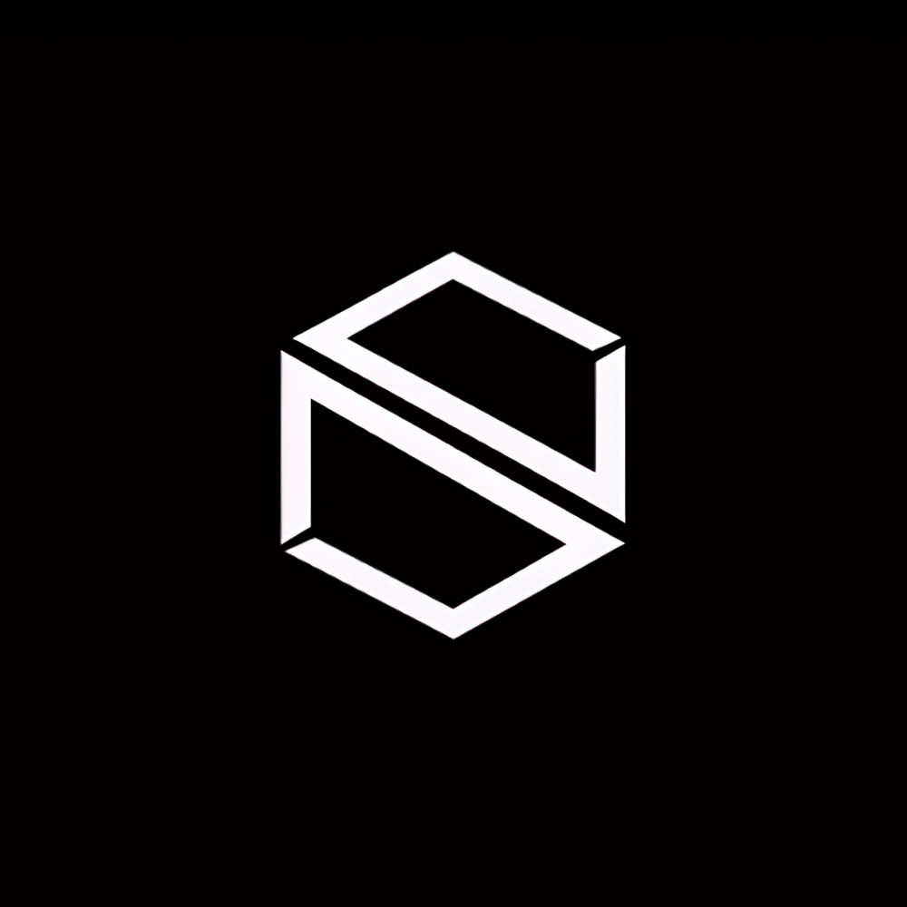

<p align="center">
  
</p>

# NEXO - Sistema de Gestao Financeira Pessoal

[](https://github.com/macksongaspar/nexo.finance/actions/workflows/ci.yml)

**Todo real recebe uma missao.**

Um aplicativo web premium de gestao financeira pessoal baseado em **Orcamento Base Zero**, com foco em disciplina, crescimento patrimonial e uma experiencia visual mais sofisticada, clara e intencional.

Preview tecnico atual:

- [https://wholesome-liberation-production.up.railway.app/](https://wholesome-liberation-production.up.railway.app/)

Observacao:

- esse link funciona hoje como ambiente tecnico de validacao
- o dominio oficial ainda nao foi definido
- para producao publica completa com Clerk, o projeto ainda precisa de dominio proprio

---

## Visao Geral

**NEXO** e uma aplicacao full-stack de gestao financeira pessoal que organiza receita, caixas, metas, historico, relatorios e inteligencia financeira em uma unica experiencia.

Ele foi pensado para quem quer controlar as financas com mais precisao e presenca visual, fugindo da cara de planilha fria e aproximando a experiencia de um sistema premium de decisao financeira pessoal.

## O Que e NEXO?

NEXO e uma solucao para quem quer acompanhar a propria vida financeira com clareza, disciplina e consistencia.

Diferente de apps convencionais de gastos, o NEXO trabalha com a logica de **Orcamento Base Zero**, onde a receita do mes e distribuida entre caixas com missao definida.

## Conceito Central

Cada real que entra deve ser alocado com intencao.

Na pratica, isso significa:

- organizar o dinheiro em caixas financeiras
- definir prioridades com clareza
- acompanhar metas e progresso ao longo do tempo
- transformar historico em leitura de comportamento
- usar inteligencia para orientar melhor as decisoes

---

## Funcionalidades Principais

### Dashboard Premium

- visualizacao de receita, distribuicao e gastos
- score financeiro com leitura sintetica da disciplina do usuario
- graficos e indicadores de acompanhamento
- leitura de investimento vs consumo

### Sistema de Caixas

- criacao de caixas por categoria
- organizacao de valores alocados por objetivo
- registro de movimentacoes e acompanhamento de saldo
- barras de progresso e leitura visual da utilizacao

Categorias-base:

- essencial
- investimento
- lazer
- reserva
- outro

### Metas Financeiras

- definicao de metas com valor alvo
- acompanhamento do progresso acumulado
- leitura de prazo e evolucao
- apoio visual para acompanhamento continuo

### Historico Mensal

- visualizacao de meses anteriores
- comparacao de evolucao ao longo do tempo
- leitura consolidada de receita, gastos e comportamento
- base para relatorios e analises futuras

### Exportacao de Dados

- exportacao em CSV
- geracao de PDF
- consolidacao de caixas, transacoes e metas

### NEXO AI

- camada de IA em evolucao para analise, recomendacao e leitura financeira
- integracao atual com APIs compativeis com OpenAI, incluindo Groq
- base preparada para ampliar insights, alertas e recomendacoes

### Open Banking

- base de interface e estrutura preparadas para expansao
- conexoes bancarias e automacoes seguem como frente de evolucao do produto

---

## Design Premium

### Estilo

Direcao visual inspirada em `Vault Architecture`, Swiss Design e interfaces de alta confianca.

### Paleta

- preto principal: `#0D0D0D`
- cinza aco: `#2E2E2E`
- branco suave: `#F5F5F5`
- cinza claro: `#BFBFBF`
- verde escuro: `#2D5016`
- vermelho discreto: `#8B2500`

### Tipografia

- titulos com linguagem geometrica e premium
- corpo com leitura limpa e forte
- valores financeiros com linguagem monoespacada e precisa

### Movimento

- transicoes suaves
- metricas com leitura progressiva
- barras e elementos de acompanhamento com reforco visual

---

## Como Comecar

Guia rapido:

```bash
pnpm install
cp .env.example .env
pnpm dev
```

Depois, acesse `http://localhost:3000`.

### Instalacao

```bash
pnpm install
```

Copie o arquivo de ambiente:

PowerShell:

```powershell
Copy-Item .env.example .env
```

Bash:

```bash
cp .env.example .env
```

Preencha as variaveis obrigatorias e rode:

```bash
pnpm dev
```

Acesse:

```txt
http://localhost:3000
```

### Primeiro Uso

1. configure o ambiente
2. acesse o app
3. autentique-se
4. organize sua receita e suas caixas
5. acompanhe metas, historico e distribuicao

---

## Stack Tecnico

| Camada | Tecnologia |
| --- | --- |
| Frontend | React 19 + Vite |
| Backend | Express + tRPC |
| Banco | MySQL |
| ORM | Drizzle |
| Autenticacao | Clerk |
| Pagamentos | Stripe |
| Estado | Zustand |
| Animacoes | Framer Motion |
| Graficos | Recharts |
| Exportacao | jsPDF + jsPDF-AutoTable |
| IA | OpenAI-compatible API |
| Deploy atual | Railway |
| Portabilidade | Docker |

---

## Estrutura do Projeto

```txt
nexo/
|-- client/
|   `-- src/
|       |-- components/
|       |-- contexts/
|       |-- hooks/
|       |-- lib/
|       |-- pages/
|       |-- stores/
|       |-- types/
|       |-- _core/
|       |-- App.tsx
|       |-- const.ts
|       |-- index.css
|       `-- main.tsx
|-- server/
|   |-- _core/
|   |-- db.ts
|   |-- index.ts
|   `-- routers.ts
|-- drizzle/
|-- shared/
|-- tests/
|-- .github/workflows/
|-- package.json
`-- README.md
```

---

## Qualidade e Operacao

### Comandos Disponiveis

```bash
pnpm dev
pnpm build
pnpm start
pnpm check
pnpm test
pnpm format
```

### Validacao da Base

Referencia minima de qualidade:

```bash
pnpm check
pnpm test
pnpm build
```

O projeto tambem possui CI no GitHub Actions para executar esse fluxo automaticamente em:

- push para `stable`
- push para `codex/**`
- pull requests para `stable`
- execucao manual via `workflow_dispatch`

---

## Dados e Ambiente

### Variaveis de ambiente base

```bash
DATABASE_URL=
VITE_CLERK_PUBLISHABLE_KEY=
CLERK_SECRET_KEY=
APP_URL=http://localhost:3000
```

### Variaveis importantes para o produto completo

```bash
OWNER_USER_ID=
STRIPE_SECRET_KEY=
STRIPE_PREMIUM_PRICE_ID=
STRIPE_PRO_PRICE_ID=
STRIPE_ELITE_PRICE_ID=
```

### Variaveis opcionais

```bash
VITE_ANALYTICS_ENDPOINT=
VITE_ANALYTICS_WEBSITE_ID=
OWNER_NOTIFICATION_WEBHOOK_URL=
OPENAI_API_KEY=
OPENAI_BASE_URL=https://api.openai.com/v1
LLM_MODEL=gpt-4.1-mini
```

Exemplo de IA via Groq:

```bash
OPENAI_API_KEY=gsk_...
OPENAI_BASE_URL=https://api.groq.com/openai/v1
LLM_MODEL=llama-3.3-70b-versatile
```

### Privacidade e estado atual

- autenticacao via Clerk
- persistencia principal em MySQL com Drizzle ORM
- deploy tecnico atual no Railway
- producao publica final com Clerk depende de dominio proprio

---

## Deploy

### Railway

1. conecte o repositorio ao Railway
2. configure as variaveis do `.env.example`
3. defina `APP_URL` com a URL publica do deploy
4. use:

```bash
Build: pnpm build
Start: pnpm start
```

### Docker

```bash
docker build -t nexo .
docker run --env-file .env -p 3000:3000 nexo
```

---

## Responsividade

- mobile: leitura e interacao adaptadas
- tablet: distribuicao intermediaria
- desktop: experiencia mais completa

---

## Roadmap

### Fundacao Tecnica

- fortalecer seguranca e confiabilidade
- ampliar protecoes e maturidade operacional
- evoluir estrutura de deploy e observabilidade

### Interface e Experiencia

- elevar dashboard e visualizacoes
- refinar sistema de caixas e transacoes
- melhorar fluidez e feedback visual

### IA NEXO

- expandir analises
- aprofundar recomendacoes
- melhorar camada de insights e interpretacao financeira

### Automacoes e Produto

- relatorios mais avancados
- notificacoes
- automacoes e acompanhamentos mais inteligentes

### Negocio e Publicacao

- amadurecer monetizacao
- fechar requisitos juridicos
- preparar publicacao publica completa

---

## Documentacao

- [README.md](./README.md)
- [NEXO_DOCUMENTATION.md](./NEXO_DOCUMENTATION.md)
- [SUPPORT.md](./SUPPORT.md)
- [.env.example](./.env.example)
- [Dockerfile](./Dockerfile)

---

## Suporte

Canal atual de suporte:

- `macksongaspar@gmail.com`

Guia rapido:

- envie o e-mail da conta usada
- descreva o problema com objetividade
- anexe print ou video se possivel
- informe horario aproximado e dispositivo

Mais detalhes em:

- [SUPPORT.md](./SUPPORT.md)

---

## Autoria

NEXO Finance e um projeto autoral de **Mackson Gaspar**.

Apresentacao recomendada da marca:

```txt
Criado por Mackson Gaspar e Bruno Souto
Um projeto autoral Tesserakt
```

Essa formulacao preserva a verdade, fortalece a marca e nao inventa uma equipe que ainda nao existe.

---

## Licenca

Licenca atual do repositorio: `MIT`

---

**Versao atual:** 1.0.0  
**Branch principal:** `stable`  
**Status atual:** base validada, CI ativo e deploy tecnico funcionando
